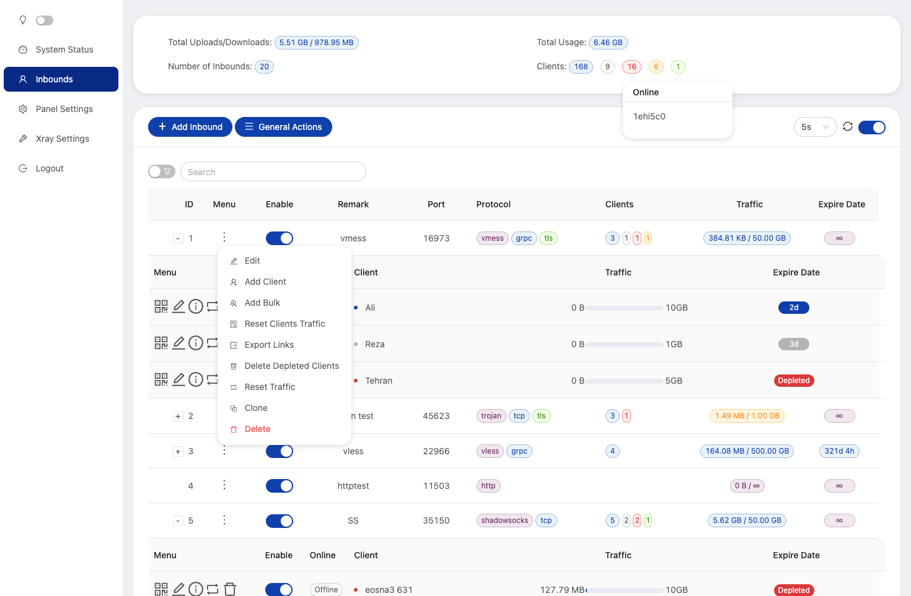
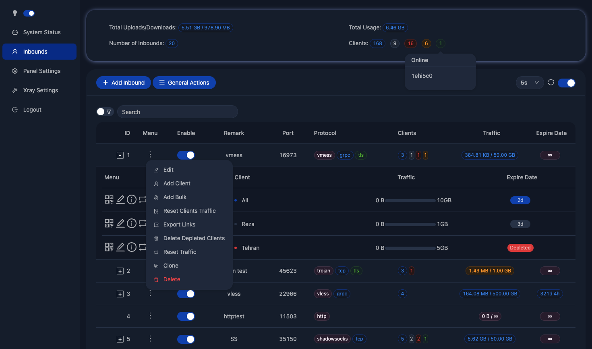

[](https://www.gnu.org/licenses/gpl-3.0.en.html)

[](https://img.shields.io/github/downloads/EarlVadim/x-ui/total.svg)

> **Disclaimer: This project is only for personal learning and communication, please do not use it for illegal purposes, please do not use it in a production environment**

> **This project is a compilation of forks of two projects by
- x-ui [Alireza Ahmadi](https://github.com/alireza0)
- x-ui-pro [Xue Xianliang](https://github.com/GFW4Fun)


# X-UI-PRO (x-ui + nginx) :octocat:	:open_file_folder:	

- Auto Installation (lightweight)
- Special for Cloudflare CDN
- Auto SSL renewal (cronjob)
- Auto-reload nginx and x-ui
- Multi-domain and sub-domain support
- Handle WebSocket and GRPC via nginx.
- Multi-user and config via port 443
- Access to x-ui panel via nginx
- Compatible with Debian 10+ and Ubuntu 20+
- More security and low detection with nginx
- Nginx with anti-exploit, keepalive=on, cache=off
- Random 150+ fake template!

xray panel supporting multi-protocol, **Multi-lang (English,Farsi,Chinese,Russian)**


| Features                             |      Enable?       |
| ------------------------------------ | :----------------: |
| Multi-lang                           | :heavy_check_mark: |
| Dark/Light Theme                     | :heavy_check_mark: |
| Search in deep                       | :heavy_check_mark: |
| Inbound Multi User                   | :heavy_check_mark: |
| Multi User Traffic & Expiration time | :heavy_check_mark: |
| REST API                             | :heavy_check_mark: |
| Telegram BOT (admin + clients)       | :heavy_check_mark: |
| Backup database using Telegram BOT   | :heavy_check_mark: |
| Subscription link + userInfo         | :heavy_check_mark: |
| Calculate expire date on first usage | :heavy_check_mark: |
| Cloudflare CDN support               | :heavy_check_mark: |

**If you think this project is helpful to you, you may wish to give a** :star2:
**Buy Me a Coffee :**

- Tron USDT (TRC20): `TZFsoK8H82fRcmo4TpGFmKAc57fvcRpMBc`
- Ethereum (ETH): `0xD6ABe71CC33E49a3A2138B77E838929D7b7bFD3b`

--------------------------------------------------------------------------------------

# Install X-UI-PRO


## Install X-UI+nging :heavy_plus_sign:
```
bash <(wget -qO- https://raw.githubusercontent.com/EarlVadim/x-ui/main/install.sh) -install yes
```
If you have worked X-UI, then it will Install nginx upper your X-UI only.
Modify X-UI from alireza0 inside.
For the additional subdomain, New A,AAAA[VPSIP] Recorde , no any config in vps!!!
SSL works for (yourdomain.com, *.yourdomain.com)
No need to on/off CDN, during installation

## Upgrade your X-UI to X-UI+nginx from alireza0 (modify)
```
bash <(wget -qO- https://raw.githubusercontent.com/EarlVadim/x-ui/main/install.sh) -upgrade yes
```
Installing a new X-UI anyway. All previous data and settings will be saved.
But in any case, I recommend making backups of configs and databases.

## Add more domains to X-UI-PRO :heavy_plus_sign:
```
bash <(wget -qO- https://raw.githubusercontent.com/EarlVadim/x-ui/main/install.sh) -subdomain sub.newdomain.com
```

## Random fake html site :earth_asia:
```
bash <(wget -qO- https://raw.githubusercontent.com/EarlVadim/x-ui/main/randomfakehtml.sh)
```

## Uninstall :x:
```
bash <(wget -qO- https://raw.githubusercontent.com/EarlVadim/x-ui/main/install.sh) -uninstall yes
```

➖➖➖➖➖➖➖➖➖➖➖➖➖➖➖➖➖➖➖➖➖➖➖➖➖
### Server Configuration :wrench:🐧⚙️


➖➖➖➖➖➖➖➖➖➖➖➖➖➖➖➖➖➖➖➖➖➖➖➖➖
### Client Configuration :white_check_mark:	:computer:🔌


## Tools
### Cloudflare Find Good IP (VPN off❗ during scanning)

CF IP Range: https://www.cloudflare.com/ips/ | https://cf.igmsy.xyz/ip-list.html

CF IP Scanner:
https://cf.igmsy.xyz |
https://cloudflare-scanner.vercel.app |
https://ircfspace.github.io/scanner/

----------------------------------------------------------------------------------------

# Features modify X-UI (alirez0)

- System Status Monitoring
- Search within all inbounds and clients
- Support Dark/Light theme UI
- Support multi-user multi-protocol, web page visualization operation
- Support multi-domain configuration and multi-certificate inbounds
- Supported protocols: vmess, vless, trojan, shadowsocks, dokodemo-door, socks, http
- Support for configuring more transport configurations
- Traffic statistics, limit traffic, limit expiration time
- Customizable xray configuration templates
- Support subscription ( multi ) link
- Detect users which are expiring or exceed traffic limit soon
- Support https access panel (self-provided domain name + ssl certificate)
- Support one-click SSL certificate application and automatic renewal
- For more advanced configuration items, please refer to the panel
- Support export/import database from panel

## suggestion system

- CentOS 8+
- Ubuntu 20+
- Debian 10+
- Fedora 36+

## API routes

- `/login` with `PUSH` user data: `{username: '', password: ''}` for login
- `/xui/API/inbounds` base for following actions:

| Method | Path                            | Action                                    |
| :----: | ------------------------------- | ----------------------------------------- |
| `GET`  | `"/"`                           | Get all inbounds                          |
| `GET`  | `"/get/:id"`                    | Get inbound with inbound.id               |
| `GET`  | `"/createbackup"`               | Telegram bot sends backup to admins       |
| `POST` | `"/add"`                        | Add inbound                               |
| `POST` | `"/del/:id"`                    | Delete Inbound                            |
| `POST` | `"/update/:id"`                 | Update Inbound                            |
| `POST` | `"/addClient/"`                 | Add Client to inbound                     |
| `POST` | `"/:id/delClient/:clientId"`    | Delete Client by clientId\*               |
| `POST` | `"/updateClient/:clientId"`     | Update Client by clientId\*               |
| `POST` | `"/getClientTraffics/:email"`   | Get Client's Traffic                      |
| `POST` | `"/resetAllTraffics"`           | Reset traffics of all inbounds            |
| `POST` | `"/resetAllClientTraffics/:id"` | Reset inbound clients traffics (-1: all)  |
| `POST` | `"/delDepletedClients/:id"`     | Delete inbound depleted clients (-1: all) |

\*- The field `clientId` should be filled by:

- `client.id` for VMESS and VLESS
- `client.password` for TROJAN
- `client.email` for Shadowsocks

# Environment Variables

| Variable       |                      Type                      | Default       |
| -------------- | :--------------------------------------------: | :------------ |
| XUI_LOG_LEVEL  | `"debug"` \| `"info"` \| `"warn"` \| `"error"` | `"info"`      |
| XUI_DEBUG      |                   `boolean`                    | `false`       |
| XUI_BIN_FOLDER |                    `string`                    | `"bin"`       |
| XUI_DB_FOLDER  |                    `string`                    | `"/etc/x-ui"` |

# Screenshot from Inbouds page




## SSL certificate application

<details>
  <summary>Click for details</summary>

### Certbot

```bash
snap install core; snap refresh core
snap install --classic certbot
ln -s /snap/bin/certbot /usr/bin/certbot

certbot certonly --standalone --register-unsafely-without-email --non-interactive --agree-tos -d <Your Domain Name>
```

</details>

## Tg robot use

<details>
  <summary>Click for details</summary>

X-UI supports daily traffic notification, panel login reminder and other functions through the Tg robot. To use the Tg robot, you need to apply for the specific application tutorial. You can refer to the [blog](https://coderfan.net/how-to-use-telegram-bot-to-alarm-you-when-someone-login-into-your-vps.html)
Set the robot-related parameters in the panel background, including:

- Tg robot Token
- Tg robot ChatId
- Tg robot cycle runtime, in crontab syntax
- Tg robot Expiration threshold
- Tg robot Traffic threshold
- Tg robot Enable send backup in cycle runtime
- Tg robot Enable CPU usage alarm threshold

Reference syntax:

- 30 \* \* \* \* \* //Notify at the 30s of each point
- 0 \*/10 \* \* \* \* //Notify at the first second of each 10 minutes
- @hourly // hourly notification
- @daily // Daily notification (00:00 in the morning)
- @every 8h // notify every 8 hours

### Telegram Bot Features

- Report periodic
- Login notification
- CPU threshold notification
- Threshold for Expiration time and Traffic to report in advance
- Support client report menu if client's telegram ID or telegram UserName added to the user's configurations
- Support telegram traffic report searched with UUID (VMESS/VLESS) or Password (TROJAN) - anonymously
- Menu based bot
- Search client by email ( only admin )
- Check all inbounds
- Check server status
- Check depleted users
- Receive backup by request and in periodic reports
- Multi language bot
</details>

# T-Shoots:

**If you upgrade from an old version or other forks, for enable traffic for users you should do :**

find this in config :

```json
 "policy": {
    "system": {
```

**and add this just after ` "policy": {` :**

```json
    "levels": {
      "0": {
        "statsUserUplink": true,
        "statsUserDownlink": true
      }
    },
```

**the final output is like :**

```json
  "policy": {
    "levels": {
      "0": {
        "statsUserUplink": true,
        "statsUserDownlink": true
      }
    },

    "system": {
      "statsInboundDownlink": true,
      "statsInboundUplink": true
    }
  },
  "routing": {
```

restart panel

</details>

# a special thanks to

- [Alireza Ahmadi](https://github.com/alireza0)
- [Xue Xianliang](https://github.com/GFW4Fun)
- [HexaSoftwareTech](https://github.com/HexaSoftwareTech/)
- [MHSanaei](https://github.com/MHSanaei)
